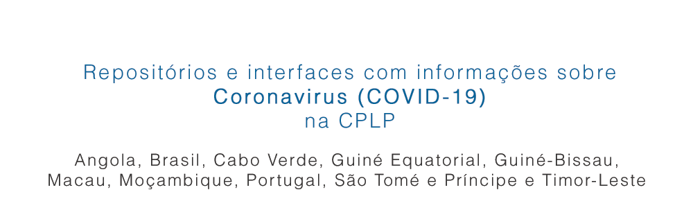
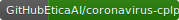
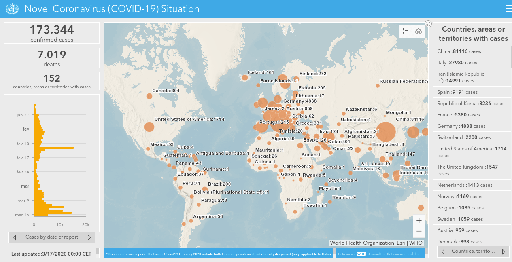
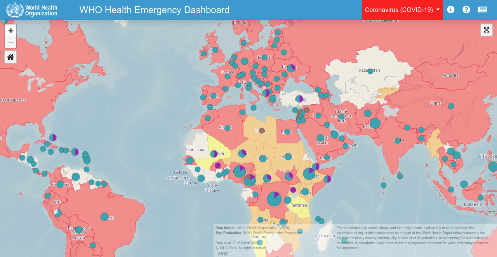
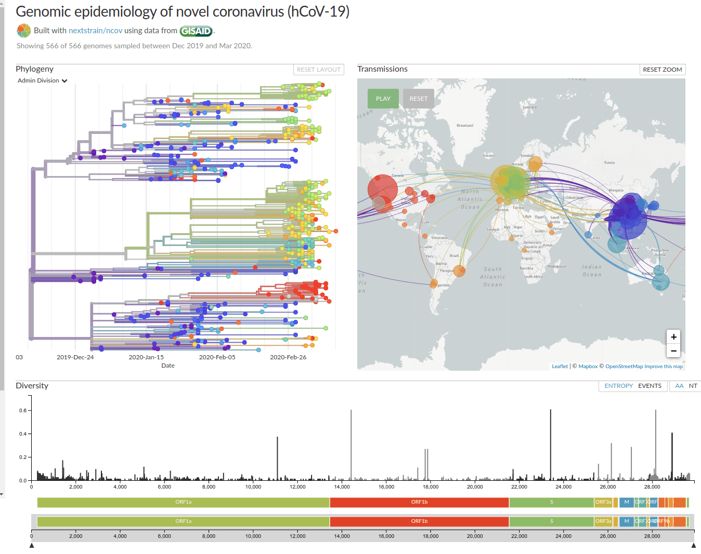
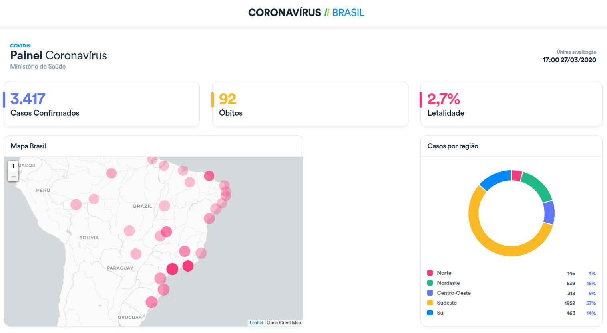
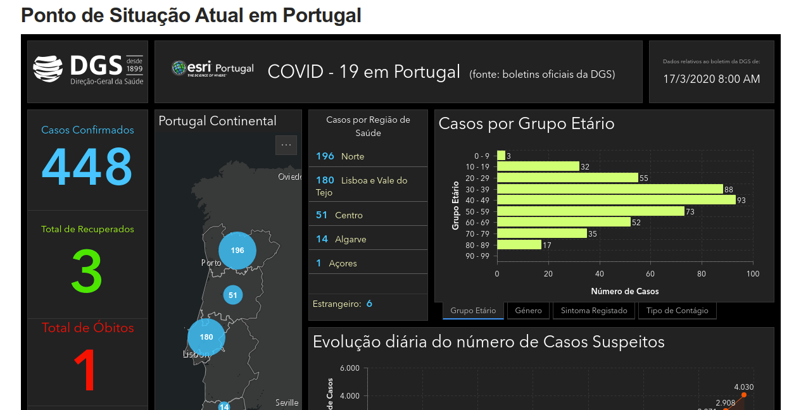
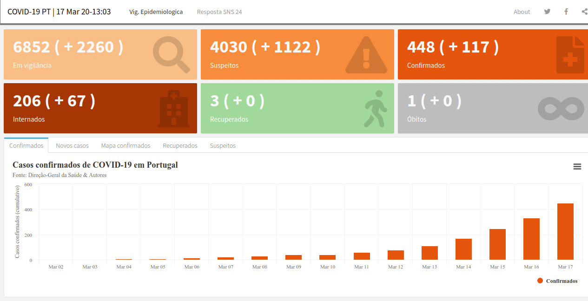

# Corona Vírus (COVID-19) na CPLP: Angola, Brasil, Cabo Verde, Guiné Equatorial, Guiné-Bissau, Macau, Moçambique, Portugal, São Tomé e Príncipe e Timor-Leste

 

**EticaAI/coronavirus-cplp: referências de dados oficiais (impacto de saúde e
econômico), ferramentas de extração/refino de dados, aplicativos e afins sobre
o Corona Vírus (COVID-19) com foco especial na Comunidade dos Países de Língua
Portuguesa (CPLP)**: Angola 🇦🇴, Brasil 🇧🇷, Cabo Verde 🇨🇻,
Guiné Equatorial 🇬🇶, Guiné-Bissau 🇬🇼, Macau 🇲🇴, Moçambique 🇲🇿,
Portugal 🇵🇹, São Tomé e Príncipe 🇵🇹 e Timor-Leste 🇹🇱.

[Sugestões são bem vindas](CONTRIBUTING.md).

> Aviso: referências não oficiais (e.g. não fornecidas **diretamente** por
governo local ou pela WHO) estão marcadas com :warning:.

---

<!--
Veja também: [pt.etica.ai](https://pt.etica.ai) \| [docs.etica.ai/pt](https://docs.etica.ai/pt) \| _cplp.etica.ai_ \| [periferia.etica.ai](https://periferia.etica.ai) \| [brasil.etica.ai](https://brasil.etica.ai) \| [groups.etica.ai](https://groups.etica.ai/) Inglês \| [standards.etica.ai](https://standards.etica.ai) Inglês

-->

<!--

TODOs:
- https://nextstrain.org/narratives/ncov/sit-rep/pt/2020-03-13?n=1
- https://ourworldindata.org/coronavirus

-->

# Índice de conteúdo

<!-- TOC depthFrom:2 depthTo:5 -->

- [Global](#global)
    - [World Health Organization (WHO)](#world-health-organization-who)
        - [WHO Coronavirus COVID-19 Dashboard](#who-coronavirus-covid-19-dashboard)
        - [WHO Health Emergency Dashboard](#who-health-emergency-dashboard)
        - [WHO Coronavirus disease (COVID-19) advice for the public](#who-coronavirus-disease-covid-19-advice-for-the-public)
    - [GISAID / Nextgen](#gisaid--nextgen)
        - [Genomic epidemiology of novel coronavirus (hCoV-19)](#genomic-epidemiology-of-novel-coronavirus-hcov-19)
    - [Deslocamento de pessoas e de carga](#deslocamento-de-pessoas-e-de-carga)
        - [Tráfego de aviões pelo Flight Radar24](#tráfego-de-aviões-pelo-flight-radar24)
        - [Tráfego de navios pelo Marine Traffic](#tráfego-de-navios-pelo-marine-traffic)
- [Angola](#angola)
    - [Ministério da Saúde de Angola](#ministério-da-saúde-de-angola)
- [Brasil](#brasil)
    - [Ministério do Brasil](#ministério-do-brasil)
        - [Notificação de casos de doença pelo coronavírus 2019 (COVID-19)](#notificação-de-casos-de-doença-pelo-coronavírus-2019-covid-19)
    - [Mercado Financeiro](#mercado-financeiro)
        - [Bovespa](#bovespa)
    - [Iniciativa comunitária](#iniciativa-comunitária)
        - [belisards/coronabr: Extrator de dados históricos do coronavírus no Brasil](#belisardscoronabr-extrator-de-dados-históricos-do-coronavírus-no-brasil)
- [Cabo Verde](#cabo-verde)
- [Guiné Equatorial](#guiné-equatorial)
- [Guiné-Bissau](#guiné-bissau)
- [Macau](#macau)
    - [Shenzhen Stock Exchange](#shenzhen-stock-exchange)
    - [Iniciativa comunitária](#iniciativa-comunitária-1)
        - [dakula009/China_CoronaVirus_Data_Miner](#dakula009china_coronavirus_data_miner)
- [Moçambique](#moçambique)
    - [Ministério da Saúde de Moçambique](#ministério-da-saúde-de-moçambique)
- [Portugal](#portugal)
    - [Serviço Nacional de Saúde de Portugal](#serviço-nacional-de-saúde-de-portugal)
        - [Ponto de Situação Atual em Portugal](#ponto-de-situação-atual-em-portugal)
        - [Materiais de divulgação para população](#materiais-de-divulgação-para-população)
    - [Iniciativa comunitária](#iniciativa-comunitária-2)
        - [aperaltasantos/covid_pt: COVID-19 em Portugal](#aperaltasantoscovid_pt-covid-19-em-portugal)
- [São Tomé e Príncipe](#são-tomé-e-príncipe)
- [Timor-Leste](#timor-leste)

<!-- /TOC -->

## Global

### World Health Organization (WHO)
#### WHO Coronavirus COVID-19 Dashboard

- Site: <https://experience.arcgis.com/experience/685d0ace521648f8a5beeeee1b9125cd>

#### WHO Health Emergency Dashboard

- Site: <https://extranet.who.int/publicemergency>

#### WHO Coronavirus disease (COVID-19) advice for the public
- <https://www.who.int/emergencies/diseases/novel-coronavirus-2019/advice-for-public>

### GISAID / Nextgen

#### Genomic epidemiology of novel coronavirus (hCoV-19)

- **Interative webapp**: <https://nextstrain.org/ncov>

### Deslocamento de pessoas e de carga
#### Tráfego de aviões pelo Flight Radar24
>:warning: Aviso: não oficial.

- <https://www.flightradar24.com/0,0/3>

#### Tráfego de navios pelo Marine Traffic
> :warning: Aviso: não oficial.

- <https://www.marinetraffic.com/pt/ais/home/centerx:15.4/centery:-7.9/zoom:3>

## Angola

### Ministério da Saúde de Angola
- Site oficial: <http://www.minsa.gov.ao/>

## Brasil

### Ministério do Brasil

#### Notificação de casos de doença pelo coronavírus 2019 (COVID-19)

- Site: <http://plataforma.saude.gov.br/novocoronavirus/>

### Mercado Financeiro

#### Bovespa
- <http://www.b3.com.br/>
- <http://www.b3.com.br/pt_br/market-data-e-indices/servicos-de-dados/market-data/cotacoes/>

### Iniciativa comunitária

#### belisards/coronabr: Extrator de dados históricos do coronavírus no Brasil
> :warning: Aviso: não oficial.

- Repositório: <https://github.com/belisards/coronabr>

## Cabo Verde

Sem informações focadas neste momento. Para dados em tempo real veja
[Global](#global). Pode obter informações oficiais em português dos demais
países da CPLP.

## Guiné Equatorial

Sem informações focadas neste momento. Para dados em tempo real veja
[Global](#global). Pode obter informações oficiais em português dos demais
países da CPLP.

## Guiné-Bissau

Sem informações focadas neste momento. Para dados em tempo real veja
[Global](#global). Pode obter informações oficiais em português dos demais
países da CPLP.

## Macau

Sem informações focadas neste momento. Para dados em tempo real veja
[Global](#global). Pode obter informações oficiais em português dos demais
países da CPLP.

### Shenzhen Stock Exchange
- Site: <http://english.sse.com.cn/>

### Iniciativa comunitária

#### dakula009/China_CoronaVirus_Data_Miner
> :warning: Aviso: não oficial.

- **Repositório**: <https://github.com/dakula009/China_CoronaVirus_Data_Miner>

## Moçambique

Sem informações focadas neste momento. Para dados em tempo real veja
[Global](#global). Pode obter informações oficiais em português dos demais
países da CPLP.

### Ministério da Saúde de Moçambique
- Site oficial: <http://www.misau.gov.mz/>

## Portugal

### Serviço Nacional de Saúde de Portugal
- **Site oficial**: <https://www.sns.gov.pt/>

#### Ponto de Situação Atual em Portugal

- **Interface Web**: <https://covid19.min-saude.pt/ponto-de-situacao-atual-em-portugal/>

#### Materiais de divulgação para população
- Site: <https://covid19.min-saude.pt/materiais-de-divulgacao//>

### Iniciativa comunitária

#### aperaltasantos/covid_pt: COVID-19 em Portugal
> :warning: Aviso: não oficial.

- **Interface Web**: <https://aperaltasantos.github.io/covid_pt/>
- **Repositório**: <https://github.com/aperaltasantos/covid_pt>

## São Tomé e Príncipe

Sem informações focadas neste momento. Para dados em tempo real veja
[Global](#global). Pode obter informações oficiais em português dos demais
países da CPLP.

## Timor-Leste

Sem informações focadas neste momento. Para dados em tempo real veja
[Global](#global). Pode obter informações oficiais em português dos demais
países da CPLP.

<!--

--- ## Outras informações

Visite <https://cplp.etica.ai/> (Fonte: <https://github.com/EticaAI/ais-ethics-cplp>)
para ver mais detalhes.

--- ### Visão Geral sobre cada país da CPLP

--- #### Códigos

| Tema X País | Angola | Brasil | Cabo Verde | Guiné Equatorial | Guiné-Bissau | Macau | Moçambique | Portugal | São Tomé e Príncipe | Timor-Leste |
| ---| ---: | ---: | ---: | ---: | ---: | ---: | ---: | ---: | ---: | ---: |
| Nome em Portguês | Angola | Brasil | Cabo Verde | Guiné Equatorial | Guiné-Bissau | Macau | Moçambique | Portugal | São Tomé e Príncipe | Timor-Leste |
| Nome em Inglês | <em lang="en">Angola</em> | <em lang="en">Brazil | <em lang="en">Cape Verde</em> | <em lang="en">Equatorial Guinea</em> | <em lang="en">Guinea-Bissau</em> | <em lang="en">Macau</em> | <em lang="en">Mozambique</em> | <em lang="en">Portugal</em> | <em lang="en">São Tomé and Príncipe</em> | <em lang="en">East Timor</em> |
| [ISO 3166-1 alfa-2](https://pt.wikipedia.org/wiki/ISO_3166-1_alfa-2) | AO | BR | CV | GQ | GW | MO | MZ | PT | ST | TL |
| [ISO 3166-1 alfa-3](https://pt.wikipedia.org/wiki/ISO_3166-1_alfa-3) | AGO | BRA | CPV  | GNQ | GNB | MAC | MOZ | PRT | STP | TLS |
| [ISO 3166-1 numérico](https://pt.wikipedia.org/wiki/ISO_3166-1_num%C3%A9rico) | 024 | 076 | 132  | 226 | 624 | 446 | 508 | 620 | 678 | 626 |
| [DDI](https://pt.wikipedia.org/wiki/Lista_de_c%C3%B3digos_telef%C3%B3nicos) | +244 | +55 | +238 | +240 | +245 | +853 | +258 | +351 | +239 | +670 |
| Domínio de Topo | .ao | .br | .cv  | .gq | .gw | .mo | .mz | .pt | .st | .tl / .tp |

-->

# Licença

Na medida do possível segundo a lei, [EticaAI](https://github.com/EticaAI)
renunciou a todos os direitos autorais e direitos conexos ou vizinhos a este
trabalho para o [Domínio Público](UNLICENSE).